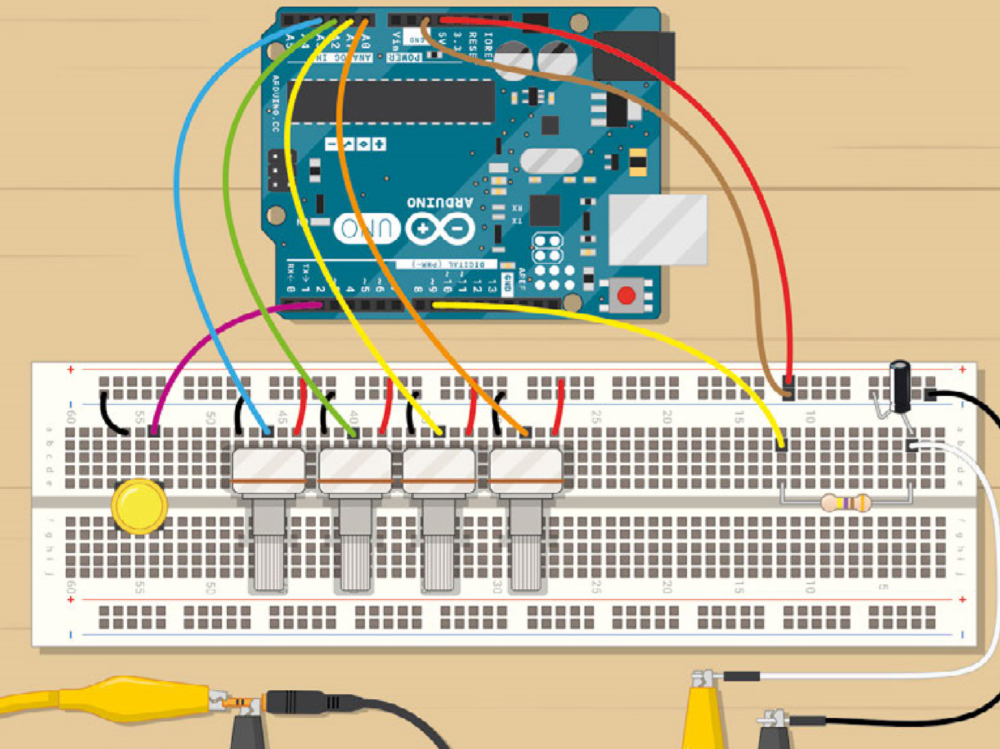

## Introduction

So, you’ve got your first Arduino, and you’ve tried a few basic projects. Maybe you’ve got an LED blinking and now you’re struggling to find a project that’s a little more creative. Look no further, we’ve got you covered! You may have achieved some basic bleeps and bloops with the built in Tone() function, but we’ll be doing some much more advanced digital synthesis. 

Digital synthesizers are very different from their analogue counterparts. Instead of a complex collection of diodes, amplifiers, oscillators, and other esoteric audio electronics, they mainly use processing power to generate waveforms and effects. Digital synths have other benefits too, but their main strength is that once set up, they’re extremely reconfigurable; you don’t need to rebuild your synth to change its sound, just reprogram it. 

Throughout this tutorial we’ll be using the Mozzi library to create a variety of sounds. The library is capable of generating complex waveforms, audio effects, and playing short samples, all from the modest hardware in an Arduino. We’ll be using it to create a basic FM (frequency modulation) synthesizer.

