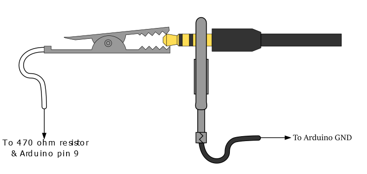

## Sine wave

We’ll get started with the absolute bare minimum for a Mozzi-based sketch. Make sure you’ve installed the Mozzi library, then start your Arduino environment and open the example under File > Examples > Mozzi > Basics > Sinewave. This is a sine wave generator, which is pretty much the digital audio equivalent of a ‘Hello, world!’ program. 

Here you’ll see the basics of a Mozzi program, and you might notice it has a slightly more complex structure than your usual Arduino sketch. Let’s ignore that for now, and get making some sound. Upload the code to your Arduino. If all is well, a sine wave will be generated on pin 9, and we just need to listen to it. To connect the Arduino to our amplifier/earphones we need to connect the following:

* Arduino pin 9 to 470 Ω resistor to Audio jack tip (the resistor is to help protect pin 9) 
* Arduino GND to Audio jack base

If all’s well, you should hear a sine wave at 440 Hz. If you have no sound, check your volume, connections, and that the sketch has uploaded successfully. If you’ve had some success, we’d recommend at this point that you take a look at some of the other examples the Mozzi library has to offer. This will give you an idea of what it’s capable of, but bear in mind that some examples expect extra hardware.

## Digital to Analogue with PWM

You might have realised that we are using pin 9, a digital pin, to do the job of an analogue output — how does this work? We are using pulse-width modulation (PWM). Simply put, if we want to approximate 2.5 V with a 5 V digital output, we switch the digital pin high for 50% of the time. 1 V would be 20%, 2 V 40%, and so on. 

PWM is most commonly used for making lights (particularly LEDs) appear at different brightnesses or motors run at different speeds, all by switching a constant voltage on or off. This approach does have significant downsides, though — mainly that it will introduce a lot of noise at your modulation frequency. Not a problem for motors or LEDs, but your ears will probably notice straight away.

