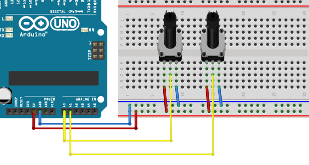

## Making adjustments

Let’s make a couple of changes to the way this works. We’ll add one pot (potentiometer) to control frequency, and a second pot to control volume. Connect two pots to your Arduino (see below). Each pot will have one side connected to 5V, the other side connected to GND and the middle (wiper) to an analogue input. We’ll use analogue inputs A0 and A1.



Add the following lines of code before void setup(): 
```
int pot0, pot1; 
int volume,frequency; 
```
These will be the variables where we’ll store the pot values, and the frequency and volume values they will control. 

Add the following lines of code inside your updateControl() function: 

```
pot0 = mozziAnalogRead(A0); 
pot1 = mozziAnalogRead(A1); 
frequency = pot0 + 50; 
volume = map(pot1, 0, 1023, 0, 255);   
aSin.setFreq(frequency); 
```

The first two lines will store our pot voltages as variables, pot0 and pot1. 

The third stores the value of pot0 + 50 to a variable called frequency. We’ve added the +50 to prevent the frequency becoming too low to hear. The fourth line will store the value of pot1 to a variable called volume, but will scale it in the process to be between 0 and 255 (instead of 0 and 1023). The last line will set the frequency of our oscillator to the value in the frequency variable This covers changing our frequency, but we need to make one last change in updateAudio() for the volume control to work.

Change the line:

```
return aSin.next(); 

```
to:

```
return (aSin.next()*volume)>>8; 
```

This line may look confusing, but it’s very similar to multiplying the output by a value between 0 and 1. It’s good to get used to calculating this way as it’s significantly faster with integer values on an Arduino, and we need speed to calculate all our sample values. 

--- collapse ---
---
title: Bitshift
---
The >> and << symbols are called bitshift operators, and they are a very fast way of dividing or multiplying by 2. The >>8 is a little like saying divide by 2, 8 times. If our volume value was 200, you could think of this line as Output × (200/256).  
--- /collapse ---

If you upload these changes, you now have a basic synthesizer! You should be able control pitch with pot 0 and volume with pot 1. 