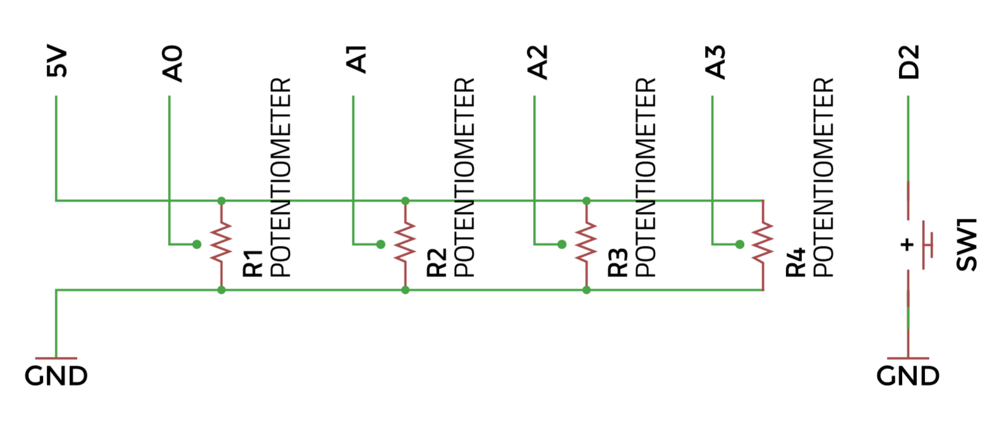

## More control
So perhaps you’ve played that for a while and become bored already. This was bound to happen – it’s only a simple synthesizer. Let’s try adding another sine wave oscillator, and another potentiometer to control it. To add another potentiometer, you can repeat the connection pattern as before, with our middle wiper pin wired to A2 on the Arduino. 



We already have the sine wave lookup table we need, so we can do this simply by duplicating the line:

```
Oscil <SIN2048_NUM_CELLS, AUDIO_RATE> aSin(SIN2048_DATA);
```

You’ll need to give our oscillators distinct names, so we should change this to:

```
Oscil <SIN2048_NUM_CELLS, AUDIO_RATE> aSin1(SIN2048_DATA); 
Oscil <SIN2048_NUM_CELLS, AUDIO_RATE> aSin2(SIN2048_DATA);  
```

We’ll add and change some variables too:

```
int pot0,pot1,pot2; 
int frequency1,frequency2,volume; 
```

Our updateControl() function will become: 

```
pot0=mozziAnalogRead(A0); 
pot1=mozziAnalogRead(A1);
pot2=mozziAnalogRead(A2); 
frequency1=pot0+50; 
frequency2=pot1+50; 
volume=map(pot2, 0, 1023, 0, 255);   
aSin1.setFreq(frequency1); 
aSin2.setFreq(frequency2); 
```

And our updateAudio() code will be changed also: 

```
return volume*((aSin1.next()+aSin2.next())>>1)>>8;
```

Our two sine waves, when added together, could add up to a number higher than our PWM output can reproduce. In audio circles this is called ‘clipping’ and is generally avoided (unless you’re intentionally after a distorted sound). We’ve prevented this here by dividing the output by two. 

The above changes should result in two controllable sine waves on pots 0 and 1. You may even be able to get some interesting ‘throbbing’ if you pitch the notes close together – this is called ‘beating’ and is caused by interference between the two frequencies. 

To develop the synth further, we’ll introduce frequency modulation (FM). This means we’ll use the output of one sine wave to control the frequency of another, resulting in varied timbres. 

We’ll also be making some changes to our hardware: adding another potentiometer; and introducing a push button to trigger the audio. 

If you make these changes to the circuit, and upload the code from < https://hsmag.cc/JPNNBP>, you should have yourself an FM synthesizer!

The magic happens in two lines. This one, in updateControl(): 

```
aSin2.setFreq(frequency2); 
```

And this line, in updateAudio(): 

```
aSin1.setFreq(frequency1+(amount*(aSin2. next())>>8)); 
```

The first sets the frequency of our modulation, and the second uses that to control the frequency of our main waveform. There is also an amount control that will multiply our modulation, with some interesting effects. Remember, now you’ll need to push the trigger button to hear sound! Try changing some of the numbers in this code and see how they affect the output. 

So, you should have a basic 8-bit synthesizer, but more importantly, an idea of how to use the Mozzi library to develop it further. Mozzi has a huge selection of basic waveforms, some audio effects, and it’s extremely well documented, with great examples. If you feel lost at any point, you can always check on the website. 

--- collapse ---
---
title: Other Arduino audio projects
---
* **ElectroSmash PedalShield**: This is a kit designed to sit on top of an Arduino Due and turn it into a general-purpose guitar effects pedal. It has some basic examples available, and a forum with many more. Electrosmash.com/pedalshield
* **Ardutouch**: International hacker Mitch Altman has created an Arduino-based synth project called Ardutouch, built on a fantastic library by himself and Bill Alessi. The library by itself is great to mess around with, although it may require an experienced Arduino user. cornfieldelectronics.com/cfe/projects.php
* **Teensy Audio Board**: This hardware for the Teensy 3.1/3.2 and the accompanying audio library get an honourable mention simply because it’s so fully featured. Not strictly Arduino, but Arduino-like. pjrc.com/teensy/td_libs_Audio.html
* There are many more useful libraries in the Arduino Library List ( <http://playground.arduino.cc/Main/LibraryList> ) under the ‘audio’ section.
 
--- /collapse ---
